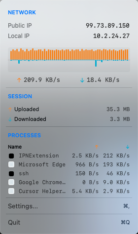
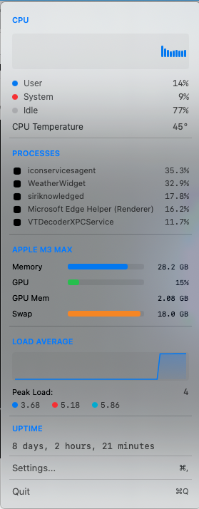
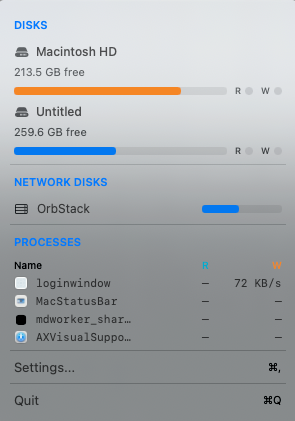

# MacStatusBar

An open-source system monitoring status bar app for macOS users.


## Features

### Network Monitor
- Real-time upload/download speeds
- Green color indicator for speeds > 1 MB/s
- Public and local IP addresses
- Per-process network activity (top 5)
- Speed history graph

### CPU + GPU + Memory Monitor
- CPU usage breakdown (User/System/Idle)
- CPU temperature indicator
- GPU usage and memory (Apple Silicon & discrete GPUs)
- Memory and swap usage
- Load average with history graph
- Top processes by CPU usage
- Top processes by memory usage
- System uptime

### Disk Monitor
- Local disk usage with visual bars
- Network disk detection
- Eject button for external and network disks
- Read/Write activity indicators
- Per-process disk I/O activity

### Robustness Features
- **Structured Logging**: Uses Apple's `os_log` for debugging via Console.app (filter by "com.macstatusbar")
- **Process Timeout**: External commands (system_profiler, ioreg, ps) have configurable timeouts to prevent hangs
- **Network Resilience**: WAN IP fetching includes retry with exponential backoff (1s, 2s, 4s) and fallback services (ipify.org -> ipinfo.io -> icanhazip.com)
- **Network Reachability**: NWPathMonitor detects connectivity changes to avoid unnecessary requests when offline
- **Health Monitoring**: Auto-recovery when monitors become stale (restarts after 30s of no updates)
- **Rate Limiting**: Prevents excessive updates under high system load (min 0.5s between updates)
- **Data Validation**: Clamps percentages (0-100%), speeds (max 10 Gbps), and handles counter wraparound
- **Graceful Timer Cleanup**: Proper deinit handling prevents race conditions on app termination

## Screenshots

### Status Bar


### Network Monitor


### CPU + GPU + Memory Monitor


### Disk Monitor


## Requirements

- macOS 14.0 (Sonoma) or later
- Apple Silicon (M1/M2/M3) recommended
- Xcode 15.0 or later (for building)

> **Note:** Intel Mac support is not fully verified. If you encounter issues on Intel-based Macs, please [open an issue](https://github.com/ysyyork/MacStatusBar/issues) or submit a pull request.

## Installation

1. Clone the repository:
   ```bash
   git clone https://github.com/ysyyork/MacStatusBar.git
   ```

2. Open `MacStatusBar.xcodeproj` in Xcode

3. Build and run (⌘R)

## Running Tests

### In Xcode
1. Open `MacStatusBar.xcodeproj`
2. Press `⌘U` or go to **Product → Test**

### From Command Line
```bash
xcodebuild test -scheme MacStatusBar -destination 'platform=macOS'
```

## Architecture

The app follows the **MVVM (Model-View-ViewModel)** pattern:

```
Sources/
├── App/
│   └── MacStatusBarApp.swift
├── Models/
│   └── AppSettings.swift
├── ViewModels/
│   ├── CPUMonitor.swift
│   ├── DiskMonitor.swift
│   └── NetworkMonitor.swift
├── Views/
│   ├── CPUContentView.swift
│   ├── DiskContentView.swift
│   ├── NetworkContentView.swift
│   ├── SettingsView.swift
│   └── SharedViews.swift
└── Utilities/
    ├── Formatters.swift
    ├── Logger.swift
    └── ProcessRunner.swift
```

## License

MIT License - see [LICENSE](LICENSE) for details.

## Contributing

Contributions are welcome! Feel free to submit issues and pull requests.
